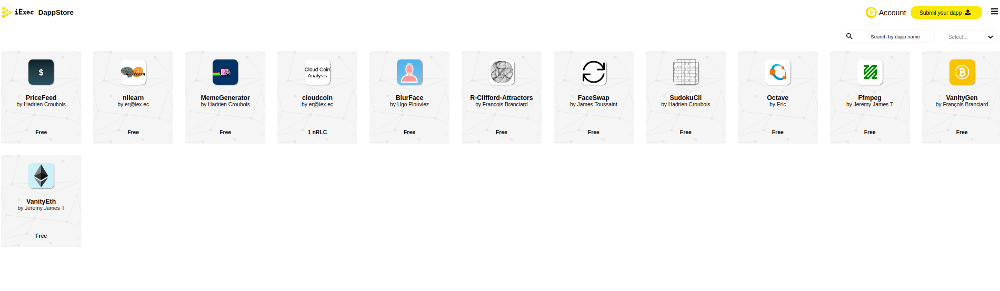

# Dapp Store

## Dapp store

The dapp store is a catalog of ready to use applications and tools.

The Dapp Store allows users to browse decentralized applications and . Users are able to browse through the listed dapps and use their favorites. These dapps are curated and represent the wide span of industries iExec can support: artificial intelligence, 3D rendering, fintech, cryptography, scientific research or IoT.

Anyone can launch its own Dapp Store and curate applications the way they see fit.

**Go to the Provide your application section.**



