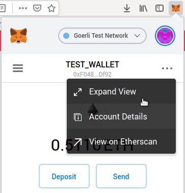
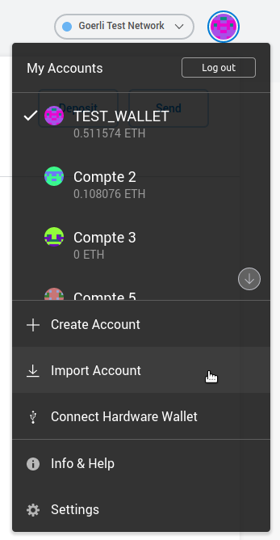
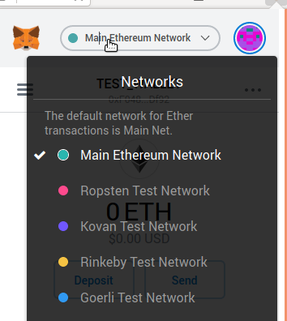
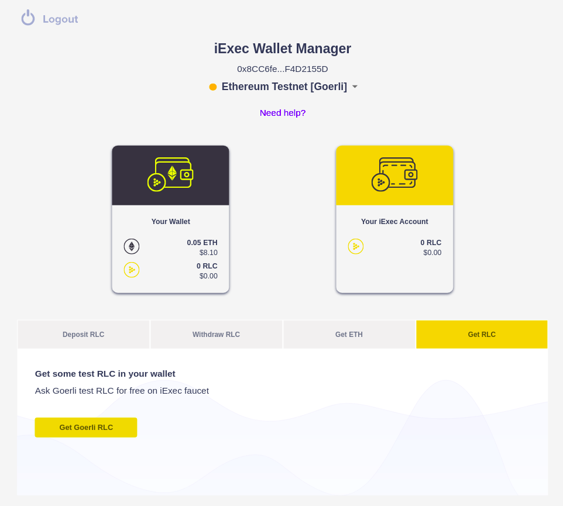
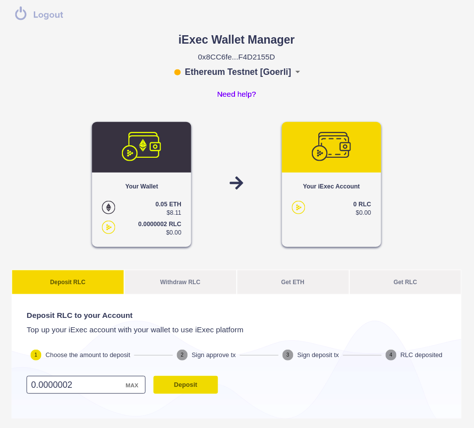

# Quick Dev Start

iExec enables decentralized docker app deployment and monetization on the blockchain.

In this tutorial we will use the iExec SDK command line to deploy an iExec app on a test blockchain.

**Tutorial Steps :**

* [Create your identity on the blockchain](quick-start-for-developers.md#create-your-identity-on-the-blockchain)
* [Initialize your iExec project](quick-start-for-developers.md#initialize-your-iExec-project)
* [Deploy your application on iExec](quick-start-for-developers.md#deploy-your-application-on-iExec)
* [Publish your application on iExec marketplace](quick-start-for-developers.md#publish-your-application-on-iExec-marketplace)
* [Request an execution of your application](quick-start-for-developers.md#request-an-execution-of-your-application)
* [What's next?](quick-start-for-developers.md#whats-next)

**prerequisite:**

* [Nodejs &gt;=v8.0.0](https://nodejs.org) installed
* A browser with [MetaMask plugin](https://metamask.io)

## Create your identity on the blockchain

On the blockchain, your identity is defined by your **wallet**, a cryptographic pair of private key and public address. What you own on the blockchain is associated with your address. The applications you deploy on iExec are associated with your wallet.

Let's setup your wallet.

Install the iExec SDK cli \(requires [Nodejs](https://nodejs.org)\)

```text
sudo npm i -g iexec
```

Create a new Wallet file

```text
iexec wallet create
```

You will be asked to choose a password to protect your wallet, don't forget it there is no way to recover it. The SDK creates a wallet file that contains a random generated private key encrypted by the chosen password and the derived public address. Make sure to backup the wallet file in a safe place and write down your address.


Your wallet is stored in the ethereum keystore, the location depends on your OS:

* On Linux: ~/.ethereum/keystore
* On Mac : ~/Library/Ethereum/keystore
* On Windows: ~/AppData/Roaming/Ethereum/keystore

Wallet file name follow the pattern `UTC--CREATION_DATE--ADDRESS`


## Initialize your iExec project

Create a new folder for your iexec project and initialize the project:

```text
mkdir my-iexec-project
cd my-iexec-project
iexec init --skip-wallet
```


The iExec SDK creates the minimum configuration files:

* `iexec.json` contains the project configuration
* `chains.json` contains the blockchain connection configuration
* we use `--skip-wallet` to skip wallet creation as we already created it


You can now connect to the blockchain. In the following steps we will use the **Goerli testnet**. Goerli is an Ethereum blockchain operated for testing purpose.

Check your wallet content on Goerli

```text
iexec wallet show --chain goerli
```

For now your wallet is empty.

Go to [Goerli Faucet](https://goerli-faucet.slock.it/) and paste your wallet address to ask some test ETH.

Check you received some Goerli ETH in your wallet:

```text
iexec wallet show --chain goerli
```


The ETH in your wallet will allow you to pay for the blockchain transaction fees. Every time you write on the blockchain \(ie: you make a transaction\) a small amount of ETH is taken from your wallet to reward the people operating the blockchain, this mechanism protects public blockchain against spam.


## Deploy your application on iExec

Initialize a new application

```text
iexec app init
```

The iExec SDK writes the minimum app configuration in `iexec.json`

| **key** | **description** |
| :--- | :--- |
| owner | app owner ethereum address \(default your wallet address\) |
| name | name of the application |
| type | type of application \("DOCKER" for docker container\) |
| multiaddr | download URI of the application \(a public docker registry\) |
| checksum | checksum of the app \("0x" + docker image digest\) |

The default app is the public docker image [iexechub/vanityeth](https://hub.docker.com/r/iexechub/vanityeth)

You can deploy this application on iExec, it will run out of the box. Where you are confident with iExec concept, you can read [Your First App](https://github.com/iExecBlockchainComputing/documentation/tree/27d732fb88bb85c49d6ad2caf93bbe8873275940/your-first-app.md) and learn how to setup your own app on iExec.

You will now deploy your app on iExec, this will be your first transaction on the blockchain:

```text
iexec app deploy --chain goerli
```


While running `iexec app deploy --chain goerli` you sent your first transaction on the goerli blockchain.

You spent a small amount of ETH from your wallet to pay for this transaction, you can check you new wallet ballance with `iexec wallet show --chain goerli` 


You can check your deployed apps with their index, let's check your first deployed app:

```text
iexec app show 1 --chain goerli
```

## Publish your application on iExec marketplace

Your application is now deployed on iExec, as owner of this application you define the conditions to use your application.


iExec uses signed orders to define the terms and conditions of use for each resource.

The terms and conditions to use an app are defined in the **apporder**.


Initialize a new apporder

```text
iexec order init --app --chain goerli
```

The SDK prepares the default apporder configuration in `iexec.json`.

| **key** | **description** |
| :--- | :--- |
| app | ethereum address of the deployed app |
| appprice | application price per run |
| volume | number of execution allowed each execution decrease the remaining volume |


You will learn more about orders management later, keep the apporder default values for now.


Sign the apporder with your wallet to make it valid on the blockchain

```text
iexec order sign --app --chain goerli
```


The signed apporder is stored locally in `orders.json`. 


Publish the apporder on iExec marketplace to share it with others

```text
iexec order publish --app --chain goerli
```

Your application is now available for everyone on iExec marketplace on the conditions defined in apporder.

You can check the published apporders for your app

```text
iexec orderbook app <your app address> --chain goerli
```

## Request an execution of your application

Before starting, make sure [MetaMask](https://metamask.io) is installed and configured on your browser.

### Import your wallet in MetaMask

Open MetaMask plugin, click **...**  and select **Expand View.**



Click on your account picture to toggle the menu and select **Import Account.**



Select import type: **JSON File**

Browse your wallet file:

* On Linux: ~/.ethereum/keystore
* On Mac : ~/Library/Ethereum/keystore
* On Windows: ~/AppData/Roaming/Ethereum/keystore

Your wallet file name looks like **UTC--\[CREATION\_DATE\]--\[ETH\_ADDRESS\]**

Enter your wallet password and click **import**.


MetaMask plugin may close while browsing your wallet file, make sure to use Expand view if you encounter this issue.



Alternatively you can get your wallet private key with iExec SDK and import it in MetaMask.  However remember, not encrypted private keys are not protected!

```text
iexec wallet show --show-private-key
```


Your wallet created with iExec SDK is now available in your MetaMask browser plugin! 

### Select Goerli Test Network in MetaMask 

Open MetaMask plugin and select Goerli in the network drop down.



You should see your wallet contains some ETH on Goerli.

### Get some test RLC

iExec is a decentralized marketplace for computing resources. The resources on the marketplace are available for iExec cryptocurrency called RLC. You will need some RLC to request an execution on iExec. On Goerli testnet, you can ask test RLC for free.

Go to [iExec Marketplace](https://market.iex.ec/) and click **Login**.

Choose MetaMask as Wallet provider, to connect your wallet with iExec Marketplace. When connected, you access the [iExec Wallet Manager](../iexec-products/wallet-management/wallet-management-using-the-ui.md)

Click **Get RLC** &gt; **Get Goerli RLC** to get some test RLC.



After a few minutes you will receive your test RLC.

### Top up your iExec account

The iExec platform actors deposit their RLC on their **iExec Account** to allow payments through the iExec Proof-of-Contribution \(PoCo\) protocol \(read more about [PoCo](../key-concepts/proof-of-contribution.md)\).

Click **Deposit RLC** and follow the steps to deposit your Goerli RLC from your wallet to your account.



Your RLC moved from your **Wallet** to your **Account**, you can now use them to buy a computation on iExec!

### Buy computation on the Marketplace

Close the iExec Wallet Manager. Fill the **Fill Market Order** form as follow:

| **field** | **description** |
| :--- | :--- |
| Order Hash | best workerpoolorder \(prefilled\) |
| Dapp Address | paste here your app address \(the apporder will be automatically fetched\) |
| Work Param | here are the input params for the app \(see [iexechub/vanityeth](https://hub.docker.com/r/iexechub/vanityeth)\) |


Click **Buy computation at market price** and complete the buy process

* confirm the trade
* sign your **requestorder**
* send a transaction to create the deal on iExec

When the deal is registered, a new line is added to **My Trades**


### Follow the execution and get the result

Click on the line of your deal on **My Trades** to follow the execution in the [iExec Explorer](https://explorer.iex.ec).

The Deal page summaries the parameters of the deal. The **Bag of tasks** table show all the tasks running for this deal \(only one in this case\)


Click on the task to follow your task execution.


When the task status is COMPLETED you can download the result from the explorer \(requires to login\).

## What's next?

You are now familiar with the iExec key concepts for the developers:

* your wallet is your onchain ID and blockchain account
* you can deploy decentralized applications on iExec
* anyone can run tasks against RLC on iExec
* payments are processed by the decentralized platform between iExec users accounts
* resources governance is managed by orders

Continue with these articles:

* [Learn how to build your fisrt application running on iExec](your-first-app.md)
* [Learn how to manage your apporders](manage-your-apporders.md)

