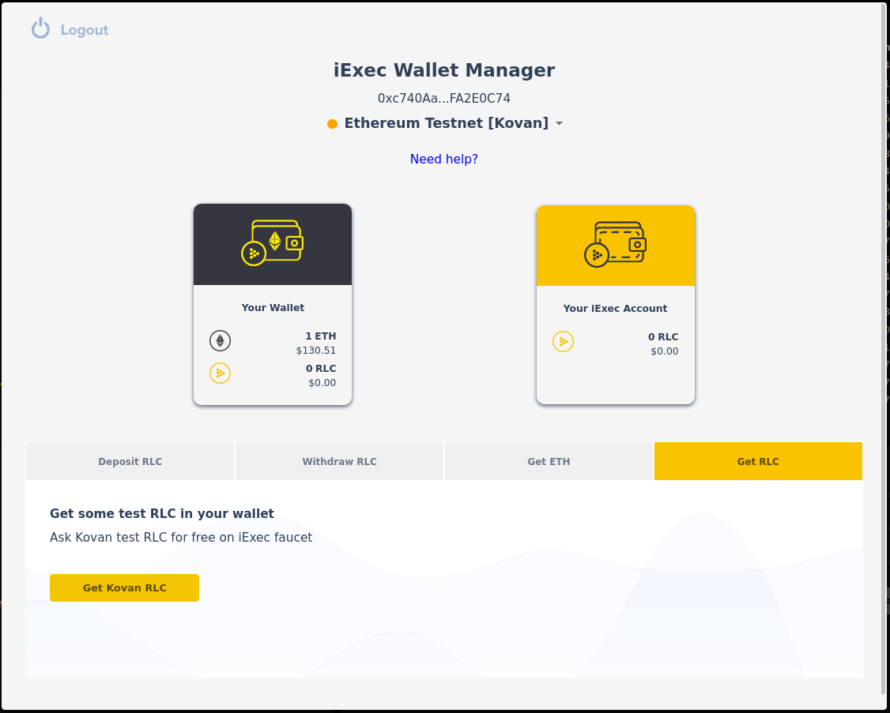
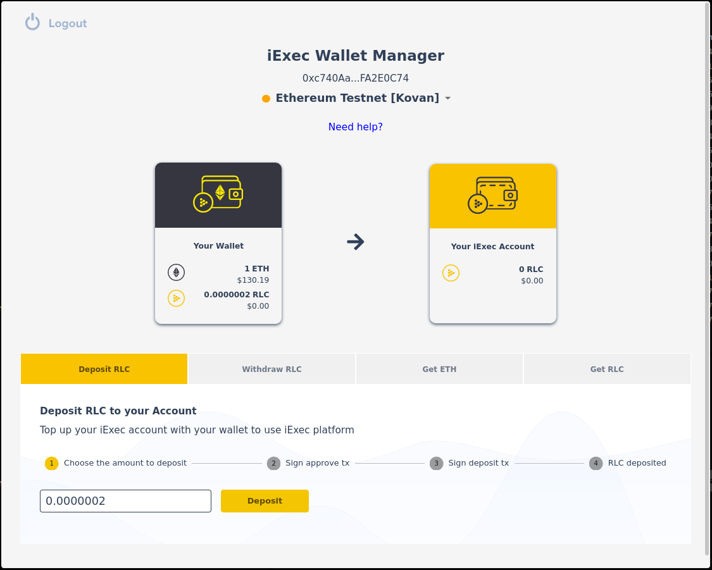
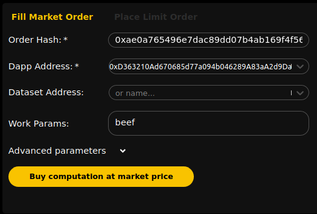
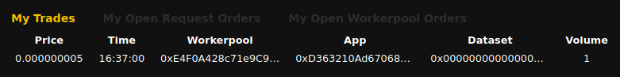
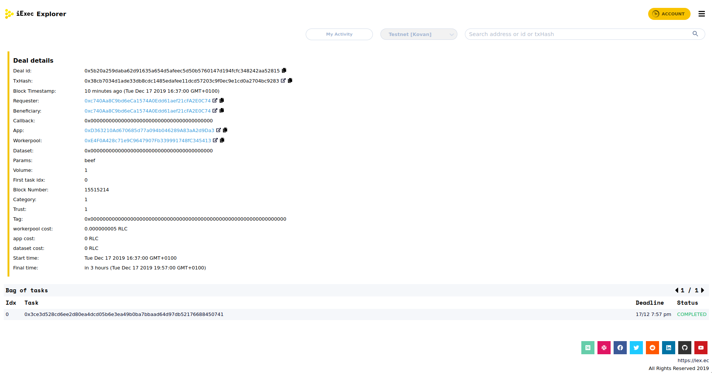
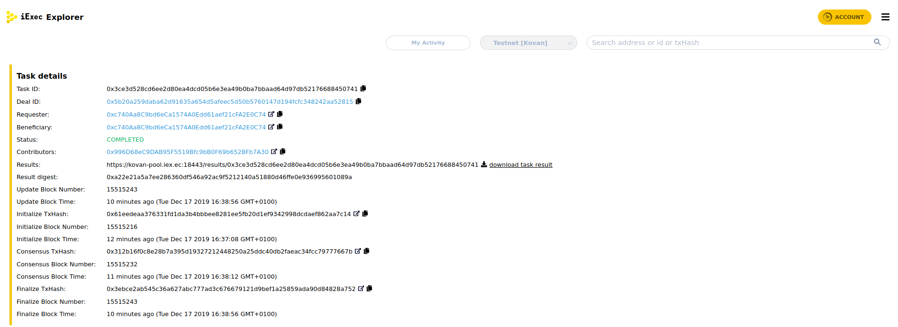

# Quick Dev Start

iExec enables decentralized app deployment and monetization on the blockchain.

In this tutorial we will use the iExec SDK command line to deploy an iExec app on a test blockchain.

**Tutorial Steps :**

* [Create your identity on the blockchain](quick-start-for-developers.md#create-your-identity-on-the-blockchain)
* [Initialize your iExec project](quick-start-for-developers.md#initialize-your-iExec-project)
* [Deploy your application on iExec](quick-start-for-developers.md#deploy-your-application-on-iExec)
* [Publish your application on iExec marketplace](quick-start-for-developers.md#publish-your-application-on-iExec-marketplace)
* [Request an execution of your application](quick-start-for-developers.md#request-an-execution-of-your-application)
* [What's next?](quick-start-for-developers.md#whats-next)

**prerequisite:**

* [Nodejs &gt;=v8.0.0](https://nodejs.org)
* [Github](https://github.com) or [Gitter](https://gitter.im) account
* A browser with [MetaMask plugin](https://metamask.io)


## Create your identity on the blockchain

On the blockchain, your identity is defined by your **wallet**, a cryptographic pair of private key and address address. What you own on the blockchain is associeted to your address.

Let's setup your wallet.

Install the iExec SDK cli \(requires Nodejs\)

```text
npm i -g iexec
```

Create a new Wallet file

```text
iexec wallet create
```

You will be asked to choose a password to protect your wallet, don't forget it there is no way to recover it. The SDK creates a wallet file that contains a random generated private key encryped by the chosen password and the associated address. Make sure to backup the wallet file in a safe place and write down your address.

## Initialize your iExec project

Create a new folder for your iexec project and initilize the project.

```text
mkdir iexec-project
cd iexec-project
iexec init --skip-wallet
```

The iExec SDK will create the minimum configuration files:

* `iexec.json` contains the project configuration
* `chains.json` contains the blockchain connection configuration
* we use `--skip-wallet` to skip wallet creation as we already created it

You can now connect to the blockchain. In the following steps we will use the Kovan testnet, Kovan is an Ethereum blockchain operated for test purpose only. Check your wallet content on Kovan:

```text
iexec wallet show --chain kovan
```

For now your wallet is empty. Go to a Kovan Faucet to ask some test ETH:

* [faucet.kovan.network](https://faucet.kovan.network/) \(you will need a github account\).
* [kovan-testnet/faucet - Gitter](https://gitter.im/kovan-testnet/faucet) \(you will need to login to gitter\).

You can now check you wallet is no more empty:

```text
iexec wallet show --chain kovan
```

The ETH in your wallet will allow you to pay for the blockchain transaction fees. Every time you writes on the blockchain \(ie: you make a transaction\) a small amount of ETH is taken from your wallet to pay the peoples operating the blockchain.

## Deploy your application on iExec

Initialize a new application.

```text
iexec app init
```

The iExec SDK writes the minimum app configuration in `iexec.json`

| **key** | **description** |
| :--- | :--- |
| owner | app owner ethereum address \(default your wallet address\) |
| name | name of the application |
| type | type of application \('DOCKER' for docker container\) |
| multiaddr | download uri of the application \(a public docker registry\) |
| checksum | checksum of the app \('0x' + docker image digest\) |

```text
owner:     0xb6811eaB0Bd3733600A3456B54C7BEf7d4Abb182 # here is the owner address (your wallet address)
name:      VanityEth # here is the name of the application
type:      DOCKER # here is the type of application (docker container)
multiaddr: registry.hub.docker.com/iexechub/vanityeth:1.1.1 # here is the address of the app (where the code is)
checksum:  0x00f51494d7a42a3c1c43464d9f09e06b2a99968e3b978f6cd11ab3410b7bcd14 # here is the checksum of the app
```

The default app points to the public docker image [iexechub/vanityeth](https://hub.docker.com/r/iexechub/vanityeth)

You can deploy this application on iExec, it will run out of the box. Where you are confident with iExec concept, you can read [Your First App](https://github.com/iExecBlockchainComputing/documentation/tree/27d732fb88bb85c49d6ad2caf93bbe8873275940/your-first-app.md) and learn how to setup your own app on iExec.

You will now deploy your app on iExec, this will be your first transaction on the blockchain:

```text
iexec app deploy --chain kovan
```

Your can check your deployed apps with their index, let's check your first deployed app.

```text
iexec app show 1 --chain kovan
```

## Publish your application on iExec marketplace

Your application is now deployed on iExec, but make it available for others. iExec uses signed orders to define the terms and conditions of use for each resources. The terms and conditions to use an app are defined in the **apporder**.

Initialize a new apporder:

```text
iexec order init --app --chain kovan
```

The SDK prepares the default apporder configuration in `iexec.json`

```text
app:                0x490dB6143aF29d968B186019B19f2E32C088d817 # your app address
appprice:           0 # the price per run
volume:             1000000 # number of execution allowed
tag:                0x0000000000000000000000000000000000000000000000000000000000000000 # specific requirements (default none)
datasetrestrict:    0x0000000000000000000000000000000000000000 # restriction on accepted dataset (default all)
workerpoolrestrict: 0x0000000000000000000000000000000000000000 # restriction on accepted workerpool (default all)
requesterrestrict:  0x0000000000000000000000000000000000000000 # restriction on accepted requester (ie: end user, default all)
```

Sign the apporder:

```text
iexec order sign --app --chain kovan
```

The signed apporder is stored localy in `orders.json`

Publish the apporder on iExec marketplace to share it with others.

```text
iexec order publish --app --chain kovan
```

Your application is now available for everyone on iExec marketplace on the conditions you defined in apporder.

You can check the published apporders for your app:

```text
iexec orderbook app <your app address> --chain kovan
```

## Request an execution of your application

Before starting make sure [MetaMask](https://metamask.io) is installed and configured on your browser

### Import your wallet in MetaMask

Get your wallet private key with iExec SDK:

```text
iexec wallet show --show-private-key
```

Open MetaMask plugin and click on your account picture to toggle the menu. Select **Import Account** and paste your private key to import your wallet You wallet will be added in the accounts list.

Open MetaMask plugin and select Kovan in the network dropdown. You should see your wallet contains some ETH on Kovan.

### Get some test RLC

iExec is a decentralized marketplace for computing resources. The resources on the marketplace are available for iExec cryptocurrency called RLC. You wille need some RLC to request an execution on iExec. On Kovan testnet, you can ask test RLC for free.

Go to [iExec Marketplace](https://market.iex.ec/) and click **Login**. Choose MetaMask as Wallet provider, to connect your wallet with iExec Marketplace. When connected, you access the [iExec Wallet Manager](../iexec-products/wallet-management/wallet-management-using-the-ui.md)

Click **Get RLC** &gt; **Get Kovan RLC** to get some RLC.



You will receive 200 nRLC \(1 nRLC = 10^\(-9\) RLC\).

### Top up your iExec account

The iExec platform actors deposit their RLC on their **iExec Account** to allow payments through the iExec Proof-of-Contribution \(PoCo\) protocol \(read more about [PoCo](../key-concepts/proof-of-contribution.md)\).

Click **Deposit RLC** and follow the steps to deposit your Kovan RLC from your wallet to your account.  



Your RLC moved from your Wallet to your Account, you can now use them to buy a computation on iExec!

### Buy computation on the Marketplace

Close the iExec Wallet Manager. Fill the **Fill Market Order** form as follow:

| **field** | **description** |
| :--- | :--- |
| Order Hash | best workerpoolorder \(prefilled\) |
| Dapp Address | paste here your app address \(the apporder will be automatically fetched\) |
| Work Param | here are the input params for the app \(see [iexechub/vanityeth](https://hub.docker.com/r/iexechub/vanityeth)\) |



Click **Buy computation at market price** and complete the buy process

* confirm the trade
* sign your **requestorder**
* send a transaction to create the deal on iExec

When the deal is registered, a new line is added to **My Trades** 



### Follow the execution and get the result

Click on the line of your deal on **My Trades** to follow the execution in the [iExec Explorer](https://explorer.iex.ec) The Deal page summaries the parameters of the deal. The **Bag of tasks** table show all the tasks running for this deal \(only one in this case\)

  



Click on the task to follow your task execution. 

 



When the task status is COMPLETED you can download the result from the explorer \(requires to login\).

## What's next?

You now familiar with the iExec key concepts for the developpers:

* wallet
* account
* app deployment
* orders

Continue with these articles:

* [Learn how to build your fisrt application running on iExec](your-first-app.md)
* [Learn how to manage your apporders](manage-your-apporders.md)
