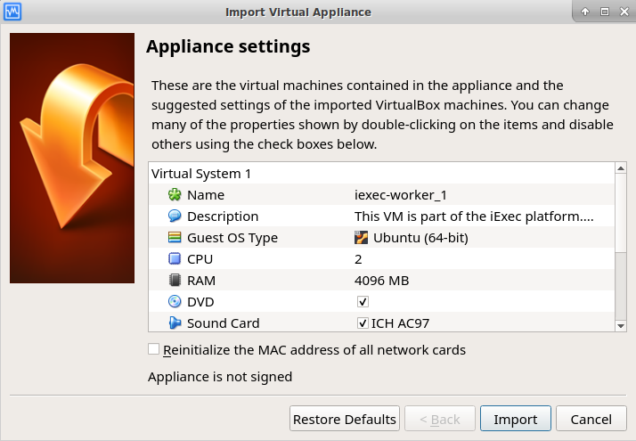
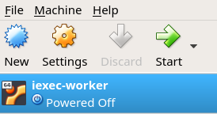
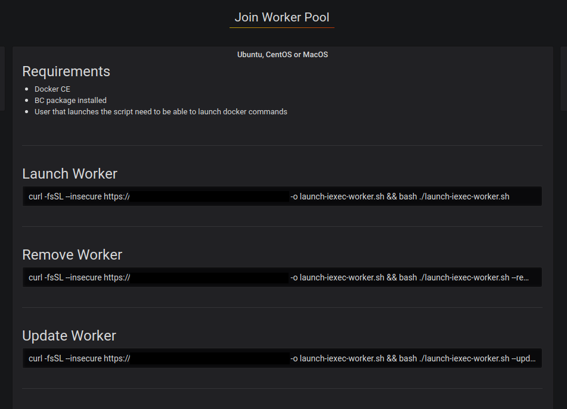
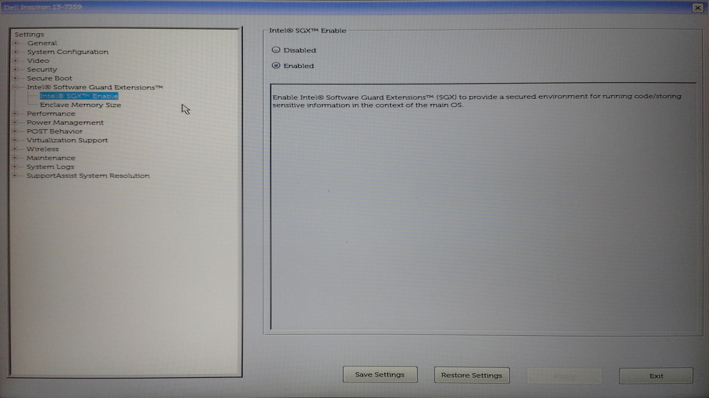

# Quick start

A worker will be rewarded with RLCs for every properly computed tasks.

Please note that:

* your wallet must be loaded with ETH and RLC must be deposited to your iExec account in order to stake for incoming tasks.
* your computer needs at least 2 CPUs.

## Start a worker

You will find a list of workerpools at [https://pools.iex.ec/](https://pools.iex.ec/)

After having loaded some ETH and deposited some RLC to your iExec account, you can start your worker.

You have different ways to join a workerpool:

* with a Virtual Machine
* with Docker
* with Join-Workerpool scripts

For security reason, it is **highly recommended to use the virtual machine**.

The Docker containers run on top of the host kernel by design, but from the point of view of security it can be seen as a risk that needs to be mitigated. As a worker, you have no control on applications that should run on your machine.

### Virtual Machine \(VM\)

A VM is ready to make you join the public workerpool.

**Download the VM**

[https://download.iex.ec/iExec-Public-Worker.ova](https://download.iex.ec/iExec-Public-Worker.ova)  
\(mirror: [https://drive.google.com/file/d/1Q655sygSbqCffmwi8G12leMzbRQLOI9x/](https://drive.google.com/file/d/1Q655sygSbqCffmwi8G12leMzbRQLOI9x/)\)

Install Virtual Box

[https://www.virtualbox.org/wiki/Downloads](https://www.virtualbox.org/wiki/Downloads)

**Get or create a wallet**

Keep your wallet in a safe place, you will need it later. Same advice for your wallet password, you will need it later. Go to the 'Wallet Management' section for more information

Top up some ETH & RLC and make a RLC deposit to your iExec account

**Launch the VM**



To import the VM, just click on iexec-worker.ova file. You will see the “Import Virtual Appliance” window. If you only have 4GB of RAM, please change the RAM to 2,048MB in this window. Delete the previous version if you had installed any in the past. Click on the ‘Import’ button.



Double click on ‘iExec-Worker’ \(or click on ‘start’\).

**Copy your wallet from your host computer to the VM**

Open the ‘keystore’ folder, then copy/paste the content of your wallet file from your host computer into the ‘wallet.json’ file of the VM.

**Start your worker**

Click on the “Launch Worker” icon on the VM desktop and follow instructions.

When the worker initialization process is complete, the worker will be started and you will get something like: **You worker is all set**. Your worker will now be able to compute some tasks comming from the iExec network to earn some RLCs.


If you want to properly shutdown your worker, you can click on the “Stop Worker” icon placed in the desktop of the VM


**Supported OS**

* Linux
* MacOS
* Windows


Change keyboard settings, this is qwerty mode by default. [https://websiteforstudents.com/configure-ubuntu-18-04-lts-beta-keyboard-layout-for-native-languages/](https://websiteforstudents.com/configure-ubuntu-18-04-lts-beta-keyboard-layout-for-native-languages/)


### Customize the VM worker with your wallet

**1 -Export your private from your wallet manager, metasmask.**

**2 - Install iexec sdk \(password: iexec\)**

Right click on the desktop, and open a terminal

```text
sudo apt-get install && sudo  npm install -g iexec
```

**3 - Import your wallet with the iExec SDK.**

```text
iexec wallet import your_private_key
```

**4 - Launch your worker, the script will automatically use the imported wallet.**

### Docker

In a terminal, run:

```text
docker run -d --name "MY_WORKER_NAME" \
   --hostname "MY_WORKER_NAME" \
   --env "IEXEC_WORKER_NAME=MY_WORKER_NAME" \
   --env "IEXEC_CORE_HOST=public-pool.iex.ec" \
   --env "IEXEC_CORE_PORT=18090" \
   --env "IEXEC_WORKER_WALLET_PATH=/iexec-wallet/wallet.json" \
   --env "IEXEC_WORKER_WALLET_PASSWORD=MY_PASSWORD" \
   -v PATH_TO_MY_WALLET_FILE:/iexec-wallet/wallet.json \
   -v /tmp/iexec-worker:/tmp/iexec-worker\
   -v /var/run/docker.sock:/var/run/docker.sock \
   iexechub/iexec-worker:3.X.X
```

Please get the lastest version available \(3.X.X\) [here](https://hub.docker.com/r/iexechub/iexec-core/tags). Note that it must match the version of the scheduler.

Please note that all the values shown here are just given as an example, it should be adapted to the worker workerpool you are trying to join and to the machine on which the worker will run.

**Here is the details for the different parameters used in the command:**

| Parameter | Meaning |
| :--- | :--- |
| IEXEC\_WORKER\_NAME | Name of your worker on the workerpool dashboard |
| EXEC\_CORE\_HOST | Domain of the scheduler |
| IEXEC\_CORE\_PORT | Port of the scheduler |
| IEXEC\_WORKER\_BASE\_DIR | Should match the tmp folder your mounting \(-v /tmp/iexec-worker\).Results of tasks will be stored in /tmp/iexec-worker/my-iexec-worker\) |
| IEXEC\_GAS\_PRICE\_MULTIPLIER | Increase it will speed up tx \(default: 1.3\)\*see Fees section |
| IEXEC\_GAS\_PRICE\_CAP | Max gas price for any tx \(default: 22Gwei\)\*see Fees section |
| IEXEC\_WORKER\_OVERRIDE\_BLOCKCHAIN\_NODE\_ADDRESS | Use a custom ethereum node here, otherwise the one given by the core will be used |

Regarding the volumes mounted with the -v option in the docker run command, they are mandatory, **if not defined the worker may not behave as expected**:

1. The option _-v /home/ubuntu/wallet.json:/iexec-wallet/wallet.json_ is used for the worker to know which wallet to use.
2. The option _-v /tmp/iexec-worker:/tmp/iexec-worker_ will be used to store all the results from the worker.
3. The option _-v /var/run/docker.sock:/var/run/docker.sock_ is to allow the worker to start new docker containers when performing tasks.

**Supported CPU**

* x86
* x86\_64

**Supported OS**

* Linux
* MacOS
* Windows

### Join-Workerpool script

When available, click on the “Join Worker Pool” button on the top left of the dashboard page and follow instructions.



**Supported OS**

* Linux

## Wallet restriction

An exclusive wallet must be associated to your worker. You need N wallets if you want N workers.

## Fees

Gas price on the Ethereum network is constantly changing. A high traffic could potentially increase average gas price since some people might want to get their transactions mined very fast. By taking a look at [https://ethgasstation.info/](https://ethgasstation.info/), you will see a Median Gas Price \(gwei\) which will be different in few hours.

* IEXEC\_GAS\_PRICE\_MULTIPLIER

For each transaction, the worker will look at the current gas price and will multiply it by a K factor in order to send \[cheap & slow\] or \[expensive & fast\] transactions. You can tune that in the config of your worker. This K factor is called IEXEC\_GAS\_PRICE\_MULTIPLIER and it default value is 1.3 \(which means a little faster than some other guys\).

* IEXEC\_GAS\_PRICE\_CAP

To avoid sending super expensive transactions, you can cap the value NETWORK\_GAS\_PRICE \* IEXEC\_GAS\_PRICE\_MULTIPLIER. This cap value is called IEXEC\_GAS\_PRICE\_CAP and the default value is 22Gwei \(you can change it too\). \(edited\)

## Statuses of Replicates

One Task bought by a requester will result in one to many Replicates depending on the level of trust set by the requester. For a given task, each worker involved will have it own Replicate containing the description of the task to compute inside. The whole computation of a Replicate is made of several stages. Each stage completed by a worker will result to an update of its Replicate status.

Here are the different possible statuses for a replicate:

* **CREATED**: A new replicate is assigned to your worker just after it asked for new one
* **RUNNING**: Your worker confirms is going to work on this replicate
* **APP\_DOWNLOADING**: Your worker is downloaing the application
* **APP\_DOWNLOADED**: The download of the application is completed
* **APP\_DOWNLOAD\_FAILED**: The download of the application failed
* **DATA\_DOWNLOADING**: Your worker is downloaing the dataset
* **DATA\_DOWNLOADED**: The download of the dataset is completed
* **DATA\_DOWNLOAD\_FAILED**: The download of the dataset failed
* **COMPUTING**: Your worker is computing the task
* **COMPUTED**: The computation is completed
* **COMPUTE\_FAILED**: The computation failed
* **CAN\_CONTRIBUTE**: Your worker can contribute the fingerprint of the computed result on chain
* **CANT\_CONTRIBUTE\_SINCE\_STAKE\_TOO\_LOW**: Your worker hasn’t enought RLC in its account to contribute \(30% of the task in RLC by default\)
* **CANT\_CONTRIBUTE\_SINCE\_TASK\_NOT\_ACTIVE**: The task is not active on chain. This status usually happens when different workers have contributed on the same task but the consensus has been reached before your contribution.
* **CANT\_CONTRIBUTE\_SINCE\_AFTER\_DEADLINE**: The deadline for the contribution is reached
* **CANT\_CONTRIBUTE\_SINCE\_CONTRIBUTION\_ALREADY\_SET**: Your worker already contributed for this task
* **CONTRIBUTING**: Your worker sent the “contribute\(..\)” transaction \(fingerprint of the result\) on chain
* **CONTRIBUTE\_FAILED**: The contribute transaction failed
* **CONTRIBUTED**: Your worker has contributed on chain
* **CANT\_REVEAL**: Your worker cant reveal the proof that it is the owner of the fingerprint of the computed result
* **REVEALING**: Your worker sent the “reveal\(..\)” transactions \(proof that he is the owner of the fingerprint of the result\)
* **REVEALED**: Your worker has revealed the proof on chain
* **REVEAL\_FAILED**: The reveal transaction failed
* **RESULT\_UPLOAD\_REQUESTED**: Your worker has been called for uploading the result to a remote filesystem
* **RESULT\_UPLOAD\_REQUEST\_FAILED**: Your worker did not accept to be called for uploading the result
* **RESULT\_UPLOADING**: Your worker is uploading the result
* **RESULT\_UPLOADED**: The result is uploaded \(to an iExec Result Repository or to IPFS\)
* **RESULT\_UPLOAD\_FAILED**: The upload of the result failed
* **COMPLETED**: The whole task is completed meaning the task is finalized. You have been rewarded if you are part of the consensus
* **REVEAL\_TIMEOUT**: Your worker took too long to reveal its proof \(more than 2 period after the consensus\)
* **WORKER\_LOST**: Your worker didn’t ping the iexec-core scheduler for a while. It is considered as out for this task
* **ABORTED\_ON\_CONSENSUS\_REACHED**: The consensus is reached but you are not part of it
* **ABORTED\_ON\_CONTRIBUTION\_TIMEOUT**: Your worker took too long to contribute \(7 periods after the purchase of the task\)
* **FAILED**: Your worker failed to participate to the task
* **OUT\_OF\_GAS**: Your worker needs some ETH, please refill its wallet
* **RECOVERING**: Your worker has been stop, it is starting back from where it stop

## SGX worker setup

As a worker you need SGX-compatible hardware if you want to perform TEE-based computations.

An unofficial list of SGX enabled CPU is available [here](https://github.com/ayeks/SGX-hardware). Basically if your computer was built after 2016 it should be good. In addition to an SGX-compatible CPU you also need to make sure the BIOS of your machine support the SGX extension. Most mainstream brand of computer \(Dell, HP,…\) do. If the SGX option is available in your BIOS then you need to enable it.



The next step is to install the drivers from Intel for the SGX extension. This can be done in one command line using the following script \(on Ubuntu\):

```text
# curl -fssl https://raw.githubusercontent.com/SconeDocs/SH/master/install_sgx_driver.sh | bash
```

That’s it! Now you can register at your scheduler as an SGX compatible worker, and you’ll soon receive requests for SGX jobs.

