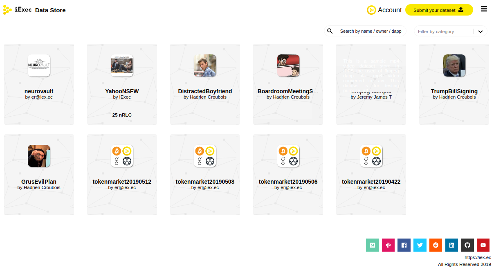

# Data Store

## Data store

The data store is a catalog of ready to use datasets.

The Data Store can be seen as a collection of dataset available as inputs for applications. Users are able to browse through the listed datasets and use their favorites.

