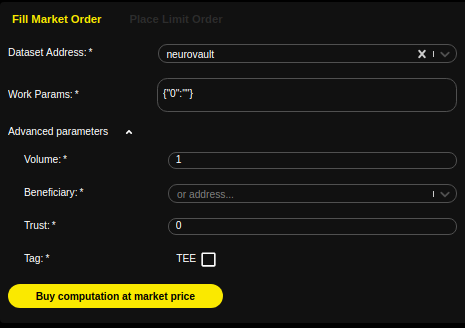

# Marketplace

Each transaction between buyers and sellers is securely audited and certified by iExec's Proof-of-Contribution algorithm \(PoCo\). At any given moment, the market is able to give customers access to a large capacity of computing power at the best rate. Worker pools place **workerpoolorders** defining the price at which they are willing to execute tasks. On this marketplace, applications and users buy **workerpoolorders** for their computations to be executed based on pre-selected criteria As a multi-sided market, applications and users will publish **requestorder**, that worker pool will accept and compute, this feature will come in V3.

iExec therefore creates a new paradigm for cloud computing: a global and open market where computing power is traded like a commodity. Comparably to the oil market, the iExec marketplace offers a uniform and standardized access to computing resources, regardless of their provider.

## Using the Marketplace and the Dapp Store

Installation of your metamask wallet in your web browser is required.

The marketplace, the Data store and the Dapp Store allow to buy **workerpoolorders** and submit computing task in a very simple way.

From the Dapp store, you can select your dapp and will be redirected to the marketplace with the dapp address and default work parameters filled. The marketplace selects also the cheapest workerpoolorder available.

From the marketplace, all existing dapps, published in the Dapp Store, are available in the select menu. It is also possible to fill in any existing dapp address and your custom arguments in the dedicated textboxes.

Visit the iExec Marketplace \([https://market.iex.ec](https://market.iex.ec)\)

