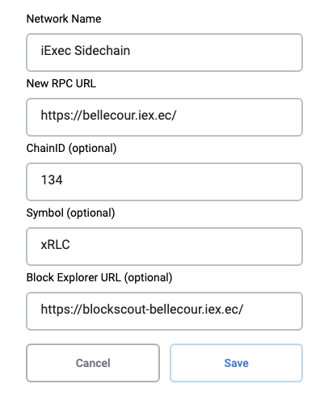
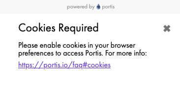
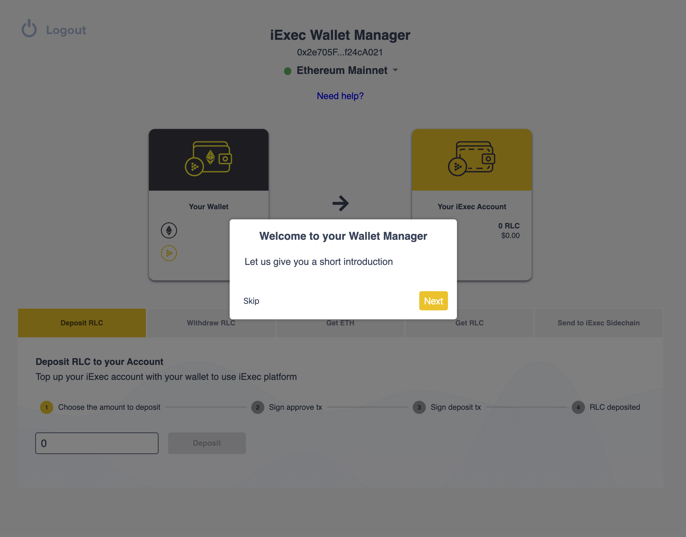
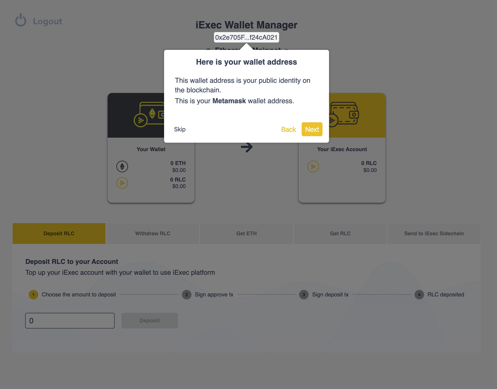
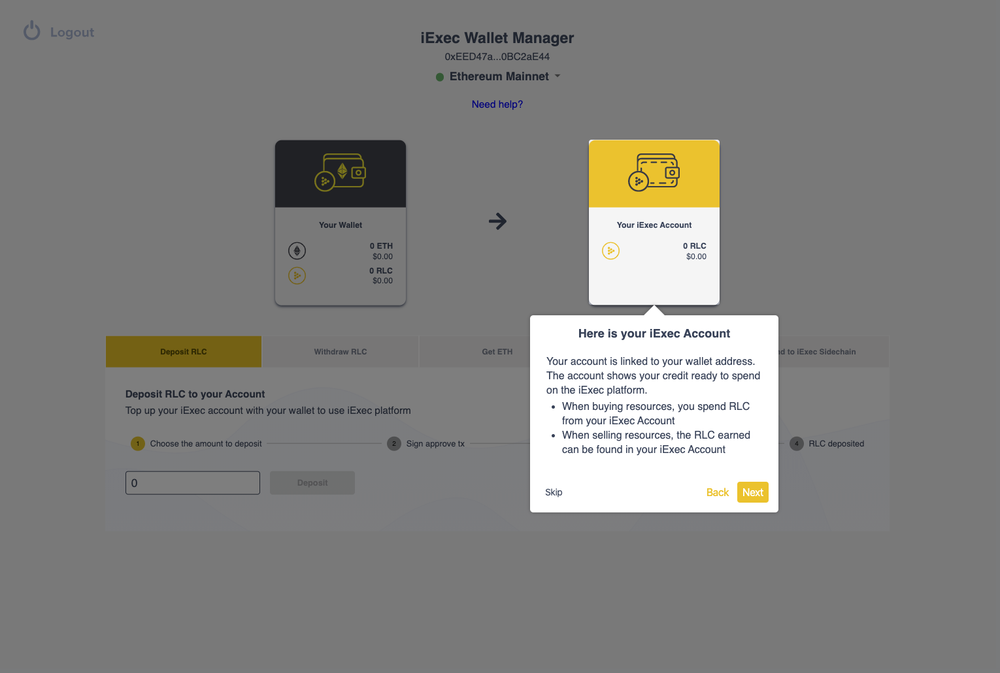
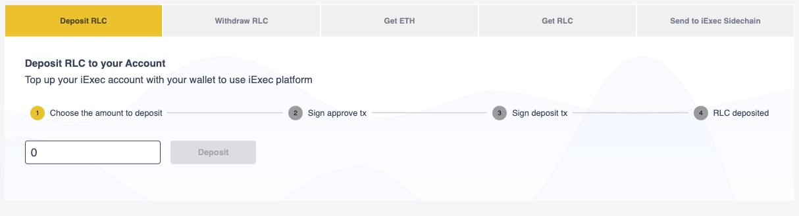
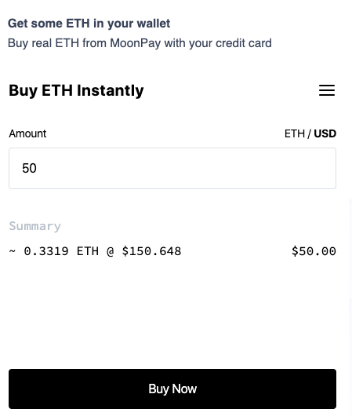
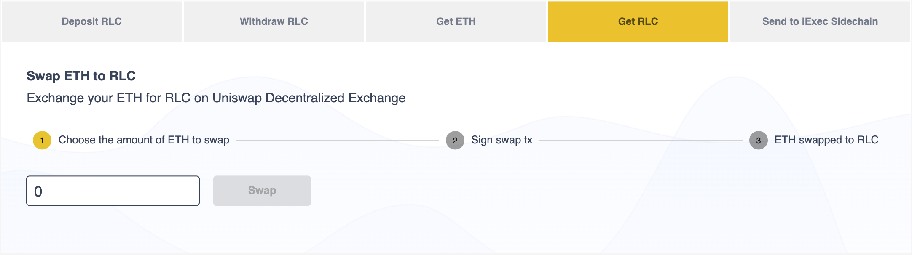

# Wallet Management using the UI

## Wallet Manager

### Choose a wallet to connect to iExec 

You will need a wallet to be able to connect and access iExec services**.**

If you already familiar blockchain, tokens, and wallets, you can connect with **Metamask**, or if you are less experienced with blockchain wallets, then you can connect with **Portis** \(log in with just an email and password\)**.**

To help you decide, more details on each of these wallets can be found below.

### **Metamask**

[MetaMask](https://metamask.io/) is a bridge that allows you to interact with decentralized services directly from your browser, using a plugin. 


**If you want to use the sidechain,  you will need to manually add the network within Metamask**


**Network Name:** iExec Sidechain

**RPC URLC:** https://bellecour.iex.ec

**ChainID:** 134

**Symbol:** xRLC

**Block explorer:** https://blockscout-bellecour.iex.ec

### **Portis**

iExec is now also compatible with the[ **Portis** ](https://www.portis.io/)wallet. With Portis wallet, instead of dealing with your own private key, you can log in with just an email address and password.  
  


**You will need enable cookies for use Portis.**


## User Interface Guide

To help you understand how to use interface and features of the iExec Wallet Manager, we've integrated an interactive guide that walks you through the user interface.

**Wallet Address**

Your wallet address is unique to your own wallet and is your public identity on the blockchain.

**Chain selector**

Using the chain selector, you can select which network you would like to connect to.

* **Testnet** provides a training environment with **free** test crypto-currencies.
* Both **Ethereum Mainnet** and **iExec Sidechain** use real cryptocurrencies.

Remember: 

* **Ethereum Mainnet** network is great for building **decentralized** apps.
* **iExec Sidechain** is **cheap** and **fast** but is more centralized.
* The **iExec Sidechain** is linked to **Ethereum Mainnet**. RLC tokens can be transferred between them.

**Here is your Wallet**

Your crypto-currencies can be found here. When connected to Ethereum Mainnet, all transactions require a small amount of ETH to be used for transaction fees. These transactions fees are sometimes referred to as 'gas' fees. Ensure you have enough ETH in your wallet to pay these.

**Here is your iExec Account**

Your iExec account is linked to your wallet address. The account shows your credit ready to spend on the iExec platform. 


Funds must be transferred from your wallet to your iExec account. The iExec account is a smart contract linked to your wallet - iExec can no control over the funds in your account.


* When buying resources, you spend the RLC from your iExec Account
* When selling resources, the RLC earned can be found in your iExec Account

## What you can do with Wallet Manager

### Deposit RLC

Use **Deposit RLC** to top up your iExec Account with funds from your wallet.

### Withdraw RLC

Use **Withdraw RLC** to withdraw the RLC from your iExec Account to your wallet.

### Get ETH \(Access Ethereum Tokens with Moonpay\)

MoonPay is a fiat currency on-ramp solution for accessing blockchain tokens using an everyday bank card. MoonPay can be used to purchase Ethereum tokens directly from within the iExec Wallet Manager.  

### Get RLC \(Using UniSwap\) 

You will need RLC tokens to use the iExec platform. One option is to use [UniSwap](https://uniswap.exchange/swap) to instantly swap your \(ETH\) Ethereum tokens with RLC tokens. UniSwap is a protocol for automated token exchange on Ethereum.   
  
Click **Get RLC** to refill your wallet with RLC. Remember that you will need to transfer this into your iExec Account before being able to use it with iExec services.   

## Using the iExec Sidechain

To use the iExec Sidechain, you will need to transfer some RLC tokens from mainnet to the sidechain.

Click Send to iExec Sidechain to transfer some RLC from your wallet to iExec Sidechain.


**Remember**:

**1 xRLC on iExec Sidechain has the same value than 1 RLC on Ethereum Mainnet.**


### Sidechain to Ethereum Mainnet

Use **Send to Ethereum Mainnet** to transfer some xRLC from your wallet to Ethereum Mainnet. Remember:

* **1 RLC** on Ethereum Mainnet has the same value than **1 xRLC** on iExec Sidechain.
* You can then transfer RLC from Ethereum Mainnet back to iExec Sidechain.

